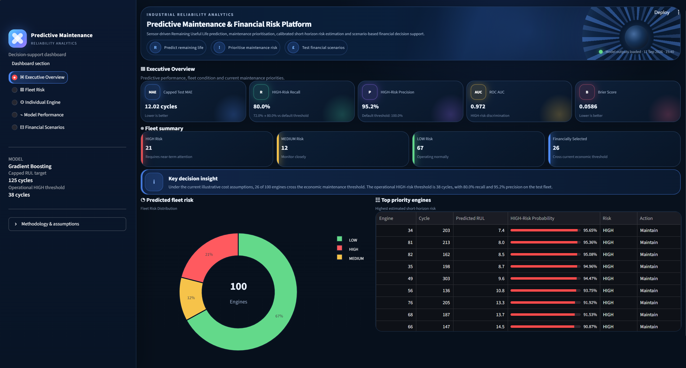
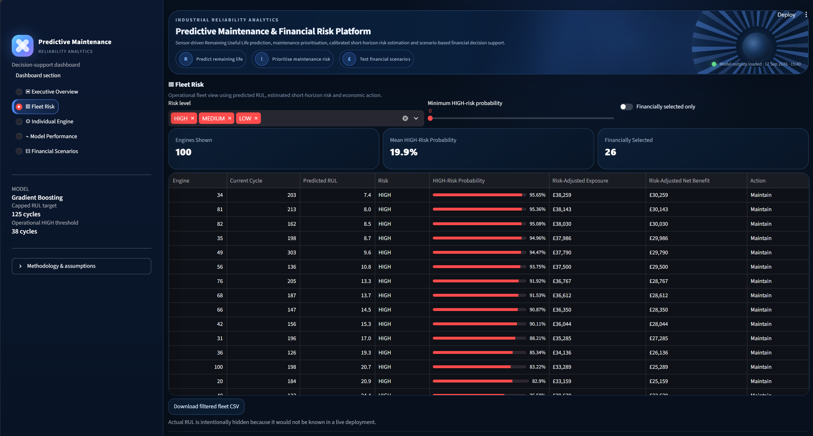
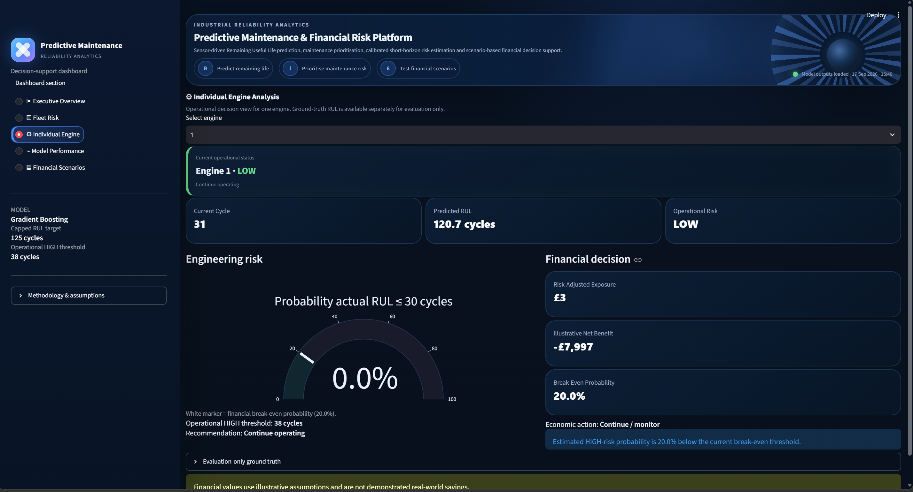
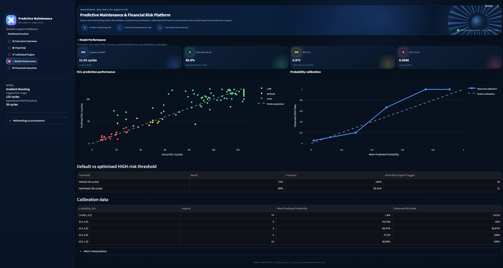
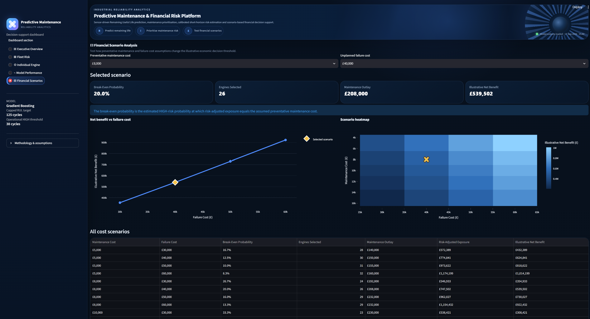
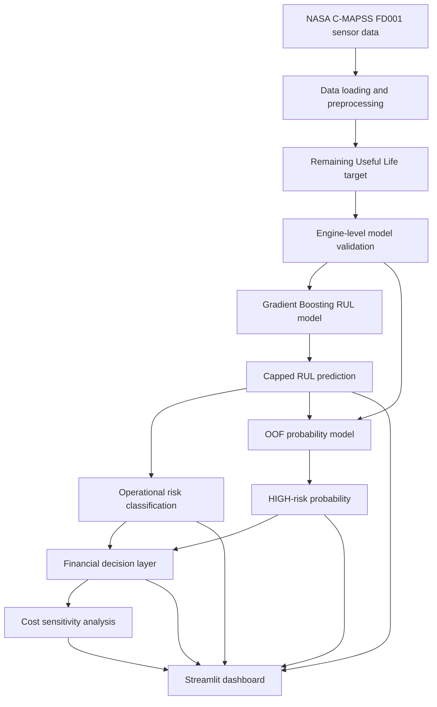

# Predictive Maintenance & Financial Risk Platform

[](https://github.com/Nyckyk/predictive-maintenance-risk-platform/actions/workflows/tests.yml)

An end-to-end predictive maintenance decision-support project built with NASA C-MAPSS turbofan degradation data.

The platform predicts **Remaining Useful Life (RUL)** from multivariate sensor data, converts predictions into operational maintenance-risk categories, estimates short-horizon HIGH-risk probability, and explores illustrative maintenance-versus-failure cost scenarios through an interactive Streamlit dashboard.

> **Portfolio note:** The financial layer uses illustrative cost assumptions. It does not represent measured NASA maintenance costs or demonstrated real-world savings.

---

## Dashboard



The dashboard contains five views:

- **Executive Overview:** headline model metrics, fleet condition, priority engines and maintenance insight
- **Fleet Risk:** operational fleet prioritisation using predicted RUL, HIGH-risk probability and economic action
- **Individual Engine:** engine-level engineering and financial decision support
- **Model Performance:** RUL accuracy, threshold comparison and probability calibration
- **Financial Scenarios:** sensitivity analysis across preventative-maintenance and unplanned-failure cost assumptions

Additional screenshots:

| Fleet Risk | Individual Engine |
|---|---|
|  |  |

| Model Performance | Financial Scenarios |
|---|---|
|  |  |

---

## Key Results

| Metric | Result |
|---|---:|
| Final capped-RUL model | Gradient Boosting |
| Capped test MAE | **12.02 cycles** |
| Operational HIGH-risk threshold | **38 cycles** |
| HIGH-risk recall | **80.0%** |
| HIGH-risk precision | **95.2%** |
| ROC AUC | **0.972** |
| Brier score | **0.0586** |
| Test engines | **100** |
| Automated tests | **33 passing** |

The optimised operational HIGH-risk threshold increased HIGH-risk recall from **72.0% to 80.0%** on the test engines while retaining **95.2% precision**.

The capped-RUL and uncapped-RUL formulations use different targets, so their MAE values should not be interpreted as a direct percentage improvement.

---

## Problem

Unexpected equipment failure can create downtime, repair costs and operational disruption.

A useful predictive-maintenance system therefore needs to do more than produce a regression estimate. It should help answer:

1. **How much useful life is likely to remain?**
2. **Which assets need attention first?**
3. **How reliable is the estimated risk?**
4. **When could preventative maintenance be economically justified?**

This project addresses those questions through a combined engineering, machine-learning and financial decision layer.

---

## System Architecture



---

## Dataset

This project uses **NASA C-MAPSS FD001**, a simulated turbofan-engine degradation dataset.

FD001 contains:

- 100 training engines
- 100 test engines
- 3 operating settings
- 21 sensor measurements
- engine cycle information
- official Remaining Useful Life values for the test engines

Each engine is represented by a multivariate time series running from an initial operating state toward failure.

### Remaining Useful Life

For the training data:

```text
RUL = maximum engine cycle - current cycle
```

The final model uses a **125-cycle capped RUL target**:

```text
capped RUL = min(RUL, 125)
```

This reduces the emphasis placed on distinguishing large early-life RUL values where the available sensor trajectory may contain limited information about the exact remaining lifetime.

---

## Methodology

### 1. Baseline model

A Linear Regression baseline was first evaluated using an engine-level 80/20 split.

**Validation MAE: 39.47 cycles**

### 2. Candidate model comparison

Three regression approaches were compared:

- Linear Regression
- Random Forest Regressor
- Gradient Boosting Regressor

A single 80/20 engine split gave:

| Model | Validation MAE |
|---|---:|
| Random Forest | 36.47 |
| Gradient Boosting | 36.52 |
| Linear Regression | 39.47 |

### 3. Engine-level cross-validation

To avoid leakage between observations belonging to the same engine, model selection used **5-fold GroupKFold cross-validation grouped by engine ID**.

Uncapped-RUL cross-validation:

| Model | Mean MAE |
|---|---:|
| Gradient Boosting | **30.59** |
| Random Forest | 30.62 |
| Linear Regression | 34.34 |

Gradient Boosting was selected based on grouped cross-validation.

### 4. Capped-RUL formulation

The same grouped validation procedure was then applied to the 125-cycle capped RUL target.

| Model | Mean CV MAE |
|---|---:|
| Gradient Boosting | **13.70** |
| Random Forest | 13.80 |
| Linear Regression | 17.72 |

The final capped Gradient Boosting model achieved:

**12.02-cycle MAE on the NASA FD001 test engines.**

---

## Maintenance Risk Logic

The reference risk regions are:

| Risk | RUL range |
|---|---:|
| HIGH | <= 30 cycles |
| MEDIUM | 31 to 60 cycles |
| LOW | > 60 cycles |

A separate **operational HIGH-alert threshold** was selected using engine-safe out-of-fold training predictions.

### Threshold optimisation

Target out-of-fold HIGH-risk recall:

**90%**

Selected predicted-RUL threshold:

**38 cycles**

Test-set classification using the optimised threshold:

| Metric | Result |
|---|---:|
| Accuracy | 89.0% |
| HIGH-risk recall | **80.0%** |
| HIGH-risk precision | **95.2%** |
| HIGH-risk engines | 25 |
| Correctly identified HIGH-risk engines | 20 |
| Missed HIGH-risk engines | 5 |
| False HIGH alerts | 1 |

The operational threshold is intentionally more conservative than the reference 30-cycle definition to detect additional near-failure engines.

---

## Risk-Region Error Analysis

Prediction error was evaluated separately by actual maintenance-risk region.

| Actual Risk | Engines | MAE | Mean Error | Overprediction Rate |
|---|---:|---:|---:|---:|
| HIGH | 25 | 10.89 | +8.90 | 72.0% |
| MEDIUM | 14 | 9.76 | +5.99 | 50.0% |
| LOW | 61 | 13.00 | +2.08 | 44.3% |

Positive mean error means the model predicts more remaining life than the ground truth.

This is especially important in the HIGH-risk region because RUL overprediction can delay maintenance action.

---

## Probability Model

A Logistic Regression model converts out-of-fold predicted capped RUL into an estimated probability that:

```text
actual RUL <= 30 cycles
```

Engine-level weighting is used so engines with longer histories do not dominate training.

### Probability evaluation

| Metric | Result |
|---|---:|
| ROC AUC | **0.972** |
| Brier score | **0.0586** |
| Log loss | **0.2232** |

Calibration was also inspected by probability bucket. Some middle probability bins contain only a small number of test engines, so their observed rates should be interpreted cautiously.

These probabilities are used as a short-horizon risk signal for the financial decision layer.

---

## Financial Decision Layer

The financial model is intentionally illustrative.

Default assumptions:

```text
Preventative maintenance cost = £8,000
Unplanned failure cost         = £40,000
```

The resulting break-even HIGH-risk probability is:

```text
£8,000 / £40,000 = 20%
```

Under this simplified decision framework:

```text
Risk-adjusted failure exposure
    = HIGH-risk probability × assumed failure cost
```

and:

```text
Illustrative risk-adjusted net benefit
    = risk-adjusted failure exposure
    - preventative maintenance cost
```

For the default scenario:

- 26 of 100 test engines cross the economic threshold
- illustrative maintenance outlay: **£208,000**
- risk-adjusted failure exposure: **£747,502**
- illustrative risk-adjusted net benefit: **£539,502**

These values are **scenario-model outputs**, not demonstrated real-world savings.

---

## Cost Sensitivity Analysis

The dashboard evaluates combinations of:

**Preventative maintenance cost**

- £5,000
- £8,000
- £10,000
- £12,000
- £15,000

**Unplanned failure cost**

- £30,000
- £40,000
- £50,000
- £60,000

For each scenario the project calculates:

- break-even HIGH-risk probability
- number of engines selected for maintenance
- maintenance outlay
- risk-adjusted failure exposure
- illustrative risk-adjusted net benefit

This makes it possible to explore how economic assumptions alter maintenance decisions without changing the underlying predictive model.

---

## Operational vs Evaluation Views

The dashboard deliberately separates **operational information** from **evaluation-only ground truth**.

Operational views use information that could realistically be available at decision time:

- current cycle
- sensor-derived predicted RUL
- predicted risk level
- HIGH-risk probability
- maintenance recommendation
- illustrative financial decision

Actual future RUL is hidden from these views because it would not be known in a live deployment.

Ground-truth RUL and prediction error are shown only in model-evaluation sections.

---

## Software Engineering

The project has been structured beyond a single modelling script to make the code easier to maintain, test and reproduce.

Key engineering features include:

- modular Python package structure
- 33 automated pytest tests
- GitHub Actions continuous integration
- Docker support
- non-interactive Matplotlib plotting for reliable pipeline execution
- separate development dependencies
- reproducible dashboard outputs

### Module responsibilities

| Module | Responsibility |
|---|---|
| `config.py` | paths, thresholds, feature names and financial assumptions |
| `data.py` | C-MAPSS loading and RUL target creation |
| `models.py` | model creation, training, cross-validation and OOF predictions |
| `risk.py` | risk categories, threshold optimisation and maintenance decisions |
| `evaluation.py` | test-set and probability-model evaluation |
| `finance.py` | financial calculations and cost sensitivity analysis |
| `plotting.py` | saved Matplotlib figures |
| `pipeline.py` | end-to-end workflow orchestration |

---

## Project Structure

```text
predictive-maintenance-risk-platform/
│
├── .github/
│   └── workflows/
│       └── tests.yml
│
├── assets/
│   ├── executive-overview.png
│   ├── fleet-risk.png
│   ├── individual-engine.png
│   ├── model-performance.png
│   └── financial-scenarios.png
│
├── data/
│   └── raw/
│       ├── train_FD001.txt
│       ├── test_FD001.txt
│       └── RUL_FD001.txt
│
├── outputs/
│   ├── financial_risk_results.csv
│   ├── cost_sensitivity_analysis.csv
│   ├── threshold_optimization.csv
│   ├── probability_calibration.csv
│   └── ...
│
├── src/
│   ├── __init__.py
│   ├── config.py
│   ├── data.py
│   ├── evaluation.py
│   ├── finance.py
│   ├── models.py
│   ├── pipeline.py
│   ├── plotting.py
│   └── risk.py
│
├── tests/
│   ├── __init__.py
│   ├── test_data.py
│   ├── test_evaluation.py
│   ├── test_finance.py
│   ├── test_models.py
│   └── test_risk.py
│
├── .dockerignore
├── .gitignore
├── app.py
├── Dockerfile
├── pytest.ini
├── README.md
├── requirements-dev.txt
├── requirements.txt
└── TESTING.md
```

The raw NASA dataset is excluded from version control and should be added locally when rerunning the modelling pipeline. The committed output files allow the dashboard to run without retraining the model.

---

## Installation

### 1. Clone the repository

```bash
git clone https://github.com/Nyckyk/predictive-maintenance-risk-platform.git
cd predictive-maintenance-risk-platform
```

### 2. Create a virtual environment

Windows PowerShell:

```powershell
python -m venv .venv
.\.venv\Scripts\Activate.ps1
```

### 3. Install dependencies

```powershell
python -m pip install -r requirements.txt
```

For development and testing:

```powershell
python -m pip install -r requirements-dev.txt
```

---

## Running the Project

### Generate model outputs

```powershell
python src\pipeline.py
```

This trains and evaluates the modelling pipeline and creates the dashboard output files.

### Start the dashboard

```powershell
streamlit run app.py
```

Then open:

```text
http://localhost:8501
```

If the output CSV files already exist and the modelling code has not changed, the pipeline does not need to be rerun before launching Streamlit.

---

## Automated Testing

The project includes **33 automated pytest tests** covering:

- RUL target creation and capping
- maintenance-risk boundaries
- HIGH-risk threshold optimisation
- maintenance recommendations
- maintenance classification metrics
- financial break-even logic
- cost sensitivity analysis
- latest engine-state selection
- raw-versus-clipped prediction behaviour
- probability-model evaluation
- model factory behaviour
- engine-safe out-of-fold validation

Run the test suite from the repository root:

```powershell
python -m pytest -q
```

Expected result:

```text
33 passed
```

The test suite is also run automatically through GitHub Actions for pushes and pull requests targeting `main`.

---

## Docker

The dashboard can be run inside a Docker container for a reproducible environment.

### Build the image

From the repository root:

```bash
docker build -t predictive-maintenance-risk-platform .
```

### Run the container

```bash
docker run --rm -p 8501:8501 predictive-maintenance-risk-platform
```

Then open:

```text
http://localhost:8501
```

The container includes the Streamlit application, modular source code and generated dashboard outputs. Raw training data is not required to run the dashboard container.

---

## Technologies

- Python
- pandas
- NumPy
- scikit-learn
- Matplotlib
- Plotly
- Streamlit
- pytest
- Docker
- GitHub Actions
- Git
- GitHub

---

## Limitations

This project should be interpreted as a portfolio decision-support system rather than a production maintenance platform.

Key limitations include:

- C-MAPSS is simulated turbofan data rather than live industrial telemetry
- FD001 contains one operating condition and one fault mode
- the financial costs are illustrative assumptions
- HIGH-risk probability represents the probability of being within 30 cycles of failure, not a directly observed probability of an unplanned £40,000 event
- calibration is evaluated on only 100 test engines, with small sample sizes in several probability bins
- the official test set was inspected during project development, including earlier baseline evaluation, so it should not be described as a completely untouched final holdout
- real deployment would require monitoring for sensor drift, model drift, calibration drift and changing operating conditions
- maintenance decisions would require domain-specific safety, operational and regulatory constraints beyond the simplified economic model used here

---

## Future Improvements

Potential extensions include:

- persist trained models and model metadata
- add additional C-MAPSS subsets such as FD002, FD003 and FD004
- investigate additional time-series feature engineering
- add uncertainty intervals around RUL predictions
- evaluate probability calibration on larger validation datasets
- connect the dashboard to a live database or API
- add maintenance-history and asset-cost inputs
- deploy the dashboard as a public live demo

---

## Why This Project

The goal was not only to build an accurate regression model, but to connect machine-learning predictions to a usable engineering decision workflow:

```text
sensor data
    ↓
remaining useful life
    ↓
maintenance risk
    ↓
risk probability
    ↓
economic scenario analysis
    ↓
decision-support dashboard
```

That combination demonstrates predictive modelling, engineering reasoning, model validation, probability analysis, financial scenario modelling, automated testing, containerisation and application development within one project.
